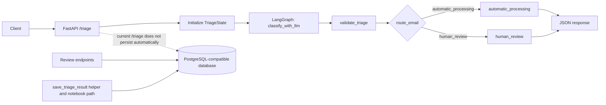
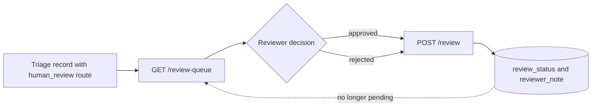
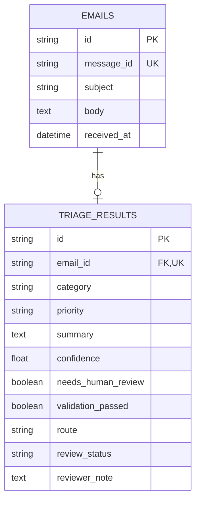

# Triage Agent

An LLM-powered email triage workflow that classifies email content, validates model decisions with deterministic rules, and routes uncertain or sensitive cases to human review.

[](https://www.python.org/)
[](https://fastapi.tiangolo.com/)
[](https://langchain-ai.github.io/langgraph/)
[](https://groq.com/)

This project explores a practical boundary between LLM prediction and software-controlled decision making. The model proposes a structured triage result; Pydantic validates its shape, deterministic rules decide whether the result is safe for automatic processing, and selected cases are exposed through a human-review workflow.

> **Scope note:** The current repository is an LLM-powered workflow and REST API. It is not a fully autonomous tool-using agent, does not ingest Gmail, and does not send email or create external tickets.

## Contents

- [Project overview](#project-overview)
- [Implemented features](#implemented-features)
- [Architecture](#architecture)
- [LangGraph workflow](#langgraph-workflow)
- [Agentic design: current scope and future evolution](#agentic-design-current-scope-and-future-evolution)
- [Validation and guardrails](#validation-and-guardrails)
- [Human-in-the-loop workflow](#human-in-the-loop-workflow)
- [API reference](#api-reference)
- [Database design](#database-design)
- [Technology stack](#technology-stack)
- [Project structure](#project-structure)
- [Setup](#setup)
- [Example workflow](#example-workflow)
- [Engineering decisions and trade-offs](#engineering-decisions-and-trade-offs)
- [Limitations and roadmap](#limitations-and-roadmap)
- [Testing status](#testing-status)
- [Interview preparation](#interview-preparation)

## Project overview

Manual email triage is repetitive, but classification alone is not enough for a workflow that may handle urgent, ambiguous, or sensitive requests. A useful system needs to preserve model uncertainty, apply business rules consistently, and provide an explicit path for human intervention.

Triage Agent separates those responsibilities:

1. **Prediction:** Groq hosts the chat model used through `ChatGroq`. The model returns a structured `TriageResult`.
2. **Validation:** Pydantic constrains categories, priorities, summary length, confidence range, and the review flag. A separate validation node applies deterministic escalation rules.
3. **Routing:** LangGraph conditionally routes the state to either `automatic_processing` or `human_review` in the runtime Python graph.
4. **Persistence:** SQLAlchemy models and a persistence helper store email and triage records. The current FastAPI `/triage` handler does not yet call that helper automatically; persistence is exercised separately by the notebook and scripts.
5. **Review:** Database-backed endpoints expose pending human-review records and allow a reviewer to set `approved` or `rejected` with an optional note.

## Implemented features

### Runtime API and workflow

- **Structured email classification:** The model predicts `Complaint`, `Feedback`, `Request`, `Spam`, or `Other`.
- **Priority and summary generation:** The model returns `Low`, `Medium`, `High`, or `Critical` priority plus a summary limited to 500 characters by the Pydantic schema.
- **Confidence-aware escalation:** Confidence below `0.70` fails validation and routes to human review.
- **Risk-based escalation:** `High` and `Critical` priorities route to human review.
- **Model-requested review:** `needs_human_review=true` also routes to human review.
- **Conditional workflow routing:** LangGraph makes the route explicit instead of treating the LLM response as the final action.
- **Review queue:** `GET /review-queue` returns records whose route is `human_review` and whose review status is `pending`.
- **Review decisions:** `POST /review` accepts `approved` or `rejected` and stores an optional reviewer note.

### Persistence and experiments

- **SQLAlchemy data model:** Email and triage records have a one-to-one relationship with a unique foreign key.
- **Persistence helper:** `save_triage_result()` creates an email row and its associated triage row in one transaction, rolling back on failure.
- **Database utilities:** `create_tables.py`, `check_database.py`, and `test_persistence.py` support local database setup and inspection.
- **Notebook experiments:** `app/graph.ipynb` demonstrates a broader experimental graph with spam handling and database-save nodes. The runtime API imports `app/graph.py`, not the notebook.

## Architecture

The runtime API follows this path:



The API owns request validation and response formatting. LangGraph owns state transitions. The model proposes a decision, while `validate_triage` applies deterministic rules before routing. SQLAlchemy owns database access for the review endpoints and the separate persistence path. There is no Gmail ingestion or external side effect in this architecture.

## LangGraph workflow

The graph state is a `TypedDict` named `TriageState`:

| Field | Type | Role |
| --- | --- | --- |
| `subject` | `str` | Email subject supplied by the API or notebook |
| `email` | `str` | Email body supplied by the API or notebook |
| `triage_result` | `TriageResult` | Structured model output |
| `validation_result` | `ValidationResult` | Deterministic validation and route decision |

The runtime graph in `app/graph.py` contains these nodes:

| Node | Responsibility | Output |
| --- | --- | --- |
| `classify_with_llm` | Rejects an empty body, builds the prompt, and invokes the structured Groq model | `triage_result` |
| `validate_triage` | Checks confidence, priority, and the model review flag | `validation_result` with errors and route |
| `automatic_processing` | Prints the accepted classification and summary | No state mutation |
| `human_review` | Prints the classification and validation reasons | No state mutation |

The runtime path is:

```text
START
  -> classify_with_llm
  -> validate_triage
  -> route_email
      -> automatic_processing -> END
      -> human_review         -> END
```

`TriageResult` restricts category and priority values with `Literal` types, requires a non-empty summary of at most 500 characters, and constrains confidence to `0.0` through `1.0`. `ValidationResult` records whether validation passed, validation errors, a review reason, and a route.

### Notebook versus runtime graph

The notebook contains additional experimental nodes named `spam_handling` and `save_to_database`. Its validation function can return a `spam` route, and its graph saves a result after each terminal branch. Those behaviors are not present in the imported runtime graph in `app/graph.py`, so they are documented as experimental rather than current API behavior.

## Agentic Design: Current Scope and Future Evolution

### Current scope

The current system is best described as a **stateful, LLM-powered workflow with conditional routing and human-in-the-loop processing**. It is not a general autonomous agent:

- The LLM produces a bounded triage proposal.
- Pydantic and deterministic business rules validate that proposal.
- LangGraph routes the state to a named workflow node.
- Human review is represented by a database-backed queue and review decision endpoint.
- Persistence stores records when the persistence helper or notebook save node is used.

There is no tool selection, external tool execution, background polling, email reply, or ticket creation in the current implementation.

### Planned Agentic Extensions

The following are **not implemented** and would require new code and stronger controls:

- Gmail API ingestion or webhook-based ingestion.
- Idempotent processing using provider message IDs.
- Approved tools for ticket creation or other external actions.
- Draft response generation with explicit human approval before sending.
- Tool-call audit logs, retries, timeouts, and failure recovery.
- Evaluation datasets, calibration checks, and production monitoring.

## Validation and guardrails

The project demonstrates a two-layer control model: schema validation constrains the shape of the LLM response, then deterministic rules decide whether the result may proceed automatically.

| Guardrail | Risk addressed | Current behavior |
| --- | --- | --- |
| Required email body | Invalid or meaningless input | `classify_with_llm` raises `ValueError` when the body is empty; the API request model also requires a non-empty `email` field. |
| Structured output | Free-form or malformed model responses | `with_structured_output(TriageResult)` requests the schema, while Pydantic constrains category, priority, summary, confidence, and the review flag. |
| Confidence threshold | Overconfident automation | Confidence below `0.70` adds a validation error and routes to `human_review`. |
| Priority escalation | Automatic handling of urgent cases | `High` and `Critical` priorities add validation errors and route to `human_review`. |
| Model review flag | Model-identified ambiguity or sensitivity | `needs_human_review=true` adds a validation error and routes to `human_review`. |
| Missing triage result | Routing without a classification | `validate_triage` creates a failed result with a human-review route. |
| Review status allow-list | Invalid reviewer decisions | `/review` accepts only `approved` or `rejected`; invalid values return HTTP 400. |
| Review route check | Updating records outside the review flow | `/review` rejects records whose route is not `human_review` with HTTP 400. |

The runtime graph does not currently implement a separate spam branch. Although `ValidationResult` permits `spam` and the notebook experiments that route, the runtime `validate_triage` function never returns it.

## Human-in-the-loop workflow

Human review is the control point for low-confidence, high-priority, critical, or model-flagged classifications. In the API implementation:

1. A triage record must have route `human_review` and review status `pending` to appear in `GET /review-queue`.
2. A reviewer submits the email UUID, `approved` or `rejected`, and an optional note to `POST /review`.
3. The endpoint updates `review_status` and `reviewer_note`, commits the transaction, and returns the updated values.
4. The queue filter excludes records after their status changes from `pending`.
5. Review does not send an email, create a ticket, or trigger another external action.



## API reference

The FastAPI application is titled `AI Email Triage API` and exposes these routes.

### `GET /`

Returns a simple health message:

```json
{
   "message": "AI Email Triage API is running"
}
```

### `POST /triage`

Runs the runtime LangGraph workflow. The request model requires non-empty `subject` and `email` strings.

Request:

```json
{
   "subject": "Unable to access my account",
   "email": "I have been locked out since this morning. Please help."
}
```

Response shape:

```json
{
   "category": "Complaint",
   "priority": "High",
   "summary": "The customer reports being locked out of an account.",
   "confidence": 0.91,
   "needs_human_review": false,
   "validation_passed": false,
   "route": "human_review",
   "review_reason": "High-priority email requires human review."
}
```

The response values are illustrative; classification and confidence come from the configured model. Invalid request bodies return HTTP 422 through FastAPI/Pydantic. Model or configuration failures are not converted into a custom application error response.

### `GET /emails`

Lists stored email rows ordered by `received_at` descending. The response includes `count` and an `emails` array containing email fields and available triage fields. It reads the database; it does not cause `/triage` to save a new record.

Example response shape:

```json
{
   "count": 1,
   "emails": [
      {
         "id": "6f9d0f5f-3b63-4c4e-b2dd-3f1aa38f65ed",
         "message_id": "local-example-001",
         "subject": "Product suggestion",
         "body": "It would be helpful if you added dark mode.",
         "received_at": "2026-09-24T12:00:00+00:00",
         "category": "Feedback",
         "priority": "Low",
         "summary": "The customer suggests adding dark mode.",
         "confidence": 0.95,
         "route": "automatic_processing",
         "needs_human_review": false
      }
   ]
}
```

### `GET /review-queue`

Returns records joined to a triage result where `route == "human_review"` and `review_status == "pending"`.

Example response shape:

```json
{
   "count": 1,
   "review_queue": [
      {
         "id": "6f9d0f5f-3b63-4c4e-b2dd-3f1aa38f65ed",
         "subject": "Unable to access my account",
         "body": "I have been locked out since this morning.",
         "category": "Complaint",
         "priority": "High",
         "summary": "The customer reports being locked out of an account.",
         "confidence": 0.91,
         "review_reason": "Requires human review"
      }
   ]
}
```

### `POST /review`

Updates a human-review record.

Request:

```json
{
   "email_id": "6f9d0f5f-3b63-4c4e-b2dd-3f1aa38f65ed",
   "status": "approved",
   "reviewer_note": "Verified the request and approved manual handling."
}
```

Response:

```json
{
   "message": "Review updated successfully.",
   "email_id": "6f9d0f5f-3b63-4c4e-b2dd-3f1aa38f65ed",
   "review_status": "approved",
   "reviewer_note": "Verified the request and approved manual handling."
}
```

Relevant errors are HTTP 400 for an invalid status or a record outside human review, HTTP 404 when the email or triage record is missing, and HTTP 422 when `email_id` is not a valid UUID.

## Database design

The application uses SQLAlchemy with a database URL supplied through `DATABASE_URL`. The repository includes `psycopg[binary]`, and the table setup script uses PostgreSQL-style `ADD COLUMN IF NOT EXISTS`; PostgreSQL is therefore the documented database target. A hosted PostgreSQL service such as Supabase may be used as infrastructure, but there is no Supabase-specific SDK or integration here.



### `emails`

- `id` is a generated UUID-shaped string primary key.
- `message_id` is required and unique.
- `subject` is required and limited to 500 characters.
- `body` is required text.
- `received_at` defaults to the current UTC time.
- The SQLAlchemy relationship is one-to-one from `Email` to `TriageRecord`, with delete-orphan cascade.

### `triage_results`

- `id` is a generated UUID-shaped string primary key.
- `email_id` is a required unique foreign key to `emails.id`, enforcing at most one triage record per email.
- Classification, priority, summary, confidence, review flag, validation result, and route are stored.
- `review_status` defaults to `pending`; the API writes `approved` or `rejected` after validation.
- `reviewer_note` is optional text.

The schema provides record-level traceability for stored email and review data, but it is not a full event-sourced audit log.

## Technology stack

| Technology | Purpose in this project |
| --- | --- |
| Python | Application and workflow implementation. |
| FastAPI | HTTP API, request models, dependency injection, and error responses. |
| Uvicorn | ASGI development server command used to run `app.main:app`; it is currently missing from `requirements.txt`. |
| LangGraph | Explicit state graph, node transitions, terminal states, and conditional routing. |
| LangChain Groq integration | `ChatGroq` model client and structured output wrapper. |
| Groq | LLM provider used by the runtime graph and direct notebook experiment. |
| Pydantic | Structured triage and validation schemas plus API input constraints. |
| SQLAlchemy | Database engine, sessions, ORM models, relationships, and transactions. |
| PostgreSQL via psycopg | Database driver and documented target for the SQLAlchemy URL. |
| python-dotenv | Loads `GROQ_API_KEY`, `GROQ_MODEL`, and `DATABASE_URL` from local `.env`. |
| Jupyter | Notebook-based graph and model experiments. |

`fastapi` and `uvicorn` are imported or required by the application but are not listed in the current `requirements.txt`; the setup section calls out this reproducibility gap explicitly.

## Project structure

```text
.
├── app/
│   ├── __init__.py
│   ├── config.ipynb       # Environment-variable checks
│   ├── database.py         # SQLAlchemy engine, session factory, DB dependency
│   ├── graph.ipynb         # Experimental notebook graph and examples
│   ├── graph.py            # Runtime LangGraph workflow
│   ├── main.py             # FastAPI application and endpoints
│   ├── models.py           # Email and TriageRecord ORM models
│   ├── persistence.py      # Transactional persistence helper
│   └── state.py            # Typed graph state and Pydantic schemas
├── 01_test_groq.ipynb      # Direct Groq connectivity/model experiment
├── check_database.py       # Prints recent persisted records
├── create_tables.py        # Creates and updates database tables
├── requirements.txt        # Python dependencies currently declared
├── test_persistence.py     # Manual persistence smoke script
└── README.md
```

There is no `app/repository.py`, frontend, screenshot collection, or automated test suite in the current repository.

## Setup

### 1. Clone and create a virtual environment

```powershell
git clone https://github.com/Saisha23/Triage-Agent.git
cd Triage-Agent
python -m venv .venv
.\.venv\Scripts\Activate.ps1
```

### 2. Install dependencies

Install the declared dependencies:

```powershell
pip install -r requirements.txt
```

The current dependency file does not include the packages imported by `app/main.py` or the documented server command. Install them for the API:

```powershell
pip install fastapi uvicorn
```

This is a repository gap, not an additional application feature. A future cleanup should add these packages to `requirements.txt`.

### 3. Configure environment variables

Create `.env` in the project root. This is a safe template only; do not paste real credentials into the README or commit `.env`:

```dotenv
GROQ_API_KEY=<your-groq-api-key>
GROQ_MODEL=<your-groq-model>
DATABASE_URL=postgresql+psycopg://<user>:<password>@<host>:<port>/<database>
```

`app/graph.py` requires `GROQ_API_KEY` and `GROQ_MODEL` to construct `ChatGroq`. `app/database.py` requires `DATABASE_URL` to construct the SQLAlchemy engine. The `.gitignore` excludes `.env` files.

### 4. Create or update tables

Make sure the PostgreSQL database is reachable, then run:

```powershell
python create_tables.py
```

The script creates the ORM tables and attempts to add the review columns. It is a lightweight setup script, not a versioned migration system.

### 5. Start the API

```powershell
uvicorn app.main:app --reload
```

Open the generated Swagger UI at <http://127.0.0.1:8000/docs>.

## Running the application

Use Swagger UI or an HTTP client to call the API. From PowerShell, the main workflow can be exercised with:

```powershell
$body = @{
   subject = "Unable to access my account"
   email = "I have been locked out since this morning. Please help."
} | ConvertTo-Json

Invoke-RestMethod -Method Post `
   -Uri http://127.0.0.1:8000/triage `
   -ContentType "application/json" `
   -Body $body
```

Database-backed routes require records to exist. The manual persistence smoke script can create a sample record after the tables are initialized:

```powershell
python test_persistence.py
python check_database.py
```

The current `/triage` endpoint returns a classification response but does not automatically call `save_triage_result()`. Consequently, `/emails` and `/review-queue` are database inspection and review surfaces for records created through the persistence path, not proof that every API triage has been stored.

## Example workflow

The following describes the implemented control flow; values are illustrative:

1. A client submits `subject` and `email` to `POST /triage`.
2. The graph invokes the configured Groq model with structured output mapped to `TriageResult`.
3. `validate_triage` checks the result. A confidence of `0.40`, for example, is below the `0.70` threshold.
4. `route_email` selects `human_review` for low confidence, `High`/`Critical` priority, or `needs_human_review=true`; otherwise it selects `automatic_processing`.
5. The endpoint returns the prediction, validation status, route, and review reason.
6. Separately, the persistence helper or notebook save node can create an `emails` row and its related `triage_results` row.
7. A pending human-review record appears in `GET /review-queue` when its stored route is `human_review`.
8. A reviewer calls `POST /review` with `approved` or `rejected` and an optional note.
9. The review status and note are committed to the triage record. No external email or ticket action follows.

## Engineering decisions and trade-offs

### Why LangGraph?

The graph makes state transitions and routing visible as named nodes and edges. That is easier to extend and inspect than burying classification, validation, and branch behavior in one LLM call or one large endpoint function.

### Why deterministic validation after an LLM call?

An LLM can produce a useful classification but should not be the sole authority for escalation. A fixed `0.70` confidence threshold and fixed priority rules make the review boundary explicit and testable. The trade-off is that these rules are currently hand-coded and not calibrated against an evaluation dataset.

### Why structured schemas?

`TriageResult` gives the model a bounded output contract and gives the application typed fields for category, priority, summary, confidence, and review intent. It reduces parsing ambiguity, although it does not guarantee that the model's judgment is correct.

### Why human review?

The workflow favors review when uncertainty or potential impact is high. This limits blind automation, but it shifts work to reviewers and does not yet provide reviewer authentication, role-based access, or a downstream action after approval.

### Why SQLAlchemy?

SQLAlchemy separates ORM models, session management, relationships, and transaction handling from graph logic. The persistence helper rolls back on failure, but the repository does not use migrations, retries, or an idempotent write strategy.

## Limitations and roadmap

### Current limitations

- The API triage path does not automatically persist the result.
- The runtime graph does not expose the notebook's experimental spam branch.
- `fastapi` and `uvicorn` are absent from `requirements.txt`.
- There is no authentication or authorization on the API or review actions.
- Review status is validated in the endpoint but not represented as a constrained database enum.
- The persistence helper creates a new record and does not handle duplicate `message_id` values idempotently.
- Error handling is mostly framework defaults; model and database failures do not have a documented custom error contract.
- There is no automated test suite, evaluation dataset, accuracy measurement, tracing, or production deployment configuration.

### Future work: not implemented

- Add Gmail ingestion through an API, polling worker, or webhook.
- Wire `/triage` to persistence with an explicit message ID and idempotency policy.
- Add a migration tool and environment-specific database configuration.
- Add unit and integration tests for schema validation, routing boundaries, API errors, and database transactions.
- Build an evaluation dataset and measure classification quality, confidence calibration, and review rate.
- Add retries, timeouts, structured logging, metrics, and tracing.
- Add reviewer authentication, authorization, and an immutable review audit trail.
- Add approved tools for ticket creation or response drafting behind human approval.
- Deploy only after security, dependency, observability, and operational hardening.

## Testing status

There is no automated test runner or test suite in the repository. `test_persistence.py` is a manual smoke script that constructs a sample `TriageResult` and `ValidationResult`, calls `save_triage_result()`, and prints the generated email ID. `check_database.py` prints up to five recent records.

Run the available manual check after configuring the database:

```powershell
python test_persistence.py
python check_database.py
```

The next testing milestone should cover validation boundaries (`0.69`, `0.70`, and `0.71`), high and critical priorities, model-requested review, invalid review status, missing records, duplicate message IDs, and API/database integration.

## Interview preparation

### Questions This Project Helps Demonstrate

**Why use LangGraph instead of a single LLM call?** LangGraph makes the state, validation step, conditional route, and terminal nodes explicit, creating a clearer extension point for human review and future workflow steps.

**How does conditional routing work?** `route_email` reads `ValidationResult.route`. The runtime graph maps `human_review` and `automatic_processing` to their corresponding nodes, and both terminate at `END`.

**How do you validate LLM output?** `with_structured_output(TriageResult)` requests the schema, Pydantic constrains the result, and `validate_triage` applies deterministic business rules afterward.

**What happens when confidence is low?** Confidence below `0.70` adds a validation error, sets the route to `human_review`, and is returned in the API response as failed validation.

**Why should high-priority emails receive human review?** The code treats `High` and `Critical` as higher-impact cases where an LLM-only decision is not sufficient; the rule makes that escalation deterministic.

**How do you prevent invalid review statuses?** The `/review` endpoint accepts only `approved` and `rejected`, returning HTTP 400 for other values.

**How is the database relationship designed?** `TriageRecord.email_id` is a unique foreign key to `Email.id`, and the ORM relationship is one-to-one with delete-orphan cascade.

**What are the limitations of the current agentic architecture?** It is a bounded workflow, not an autonomous agent: it has no tool selection, external side effects, Gmail ingestion, authentication, evaluation metrics, or automatic API persistence.

**How would you add Gmail ingestion safely?** Add a separate authenticated ingestion boundary, persist provider message IDs with an idempotency constraint, validate and normalize payloads, enqueue work, and keep external actions behind explicit approval.

**How would you add tools without allowing unsafe actions?** Define a narrow allow-list of typed tools, validate arguments, enforce authorization and timeouts, record tool calls, make side effects approval-gated, and handle retries and failures explicitly.

## Security and responsible use

- Keep `.env` local; never commit `GROQ_API_KEY`, database credentials, tokens, or copied provider responses containing sensitive email content.
- Use placeholders in documentation and rotate credentials immediately if they are exposed.
- Treat model output as a proposal, not authorization to perform an external action.
- Add authentication, authorization, rate limiting, and data-handling controls before exposing the API beyond a trusted development environment.
- Review retention and access policies before storing real email content in a database.

## Recommended portfolio additions

The repository currently contains no screenshots, architecture images, or benchmark results. Useful additions for a portfolio version would be:

- A redacted Swagger UI screenshot showing `/triage` and `/review`.
- A rendered architecture diagram showing the runtime graph and persistence boundary.
- A short terminal capture of a low-confidence message entering the review queue.
- A schema diagram generated from the actual database models.
- A small evaluation report with a versioned dataset, confusion matrix, review rate, and confidence calibration. Do not add metrics until they are measured.